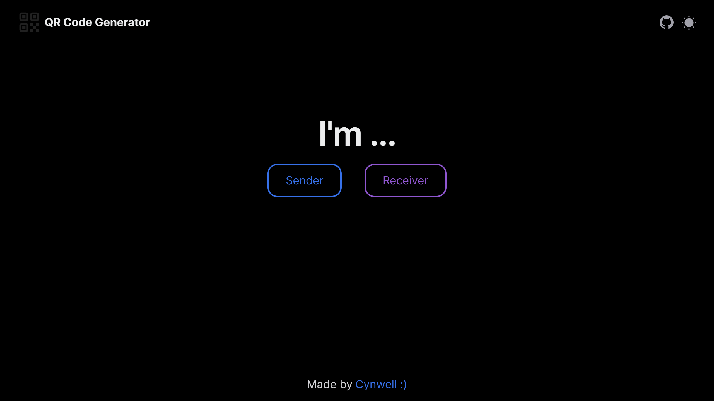
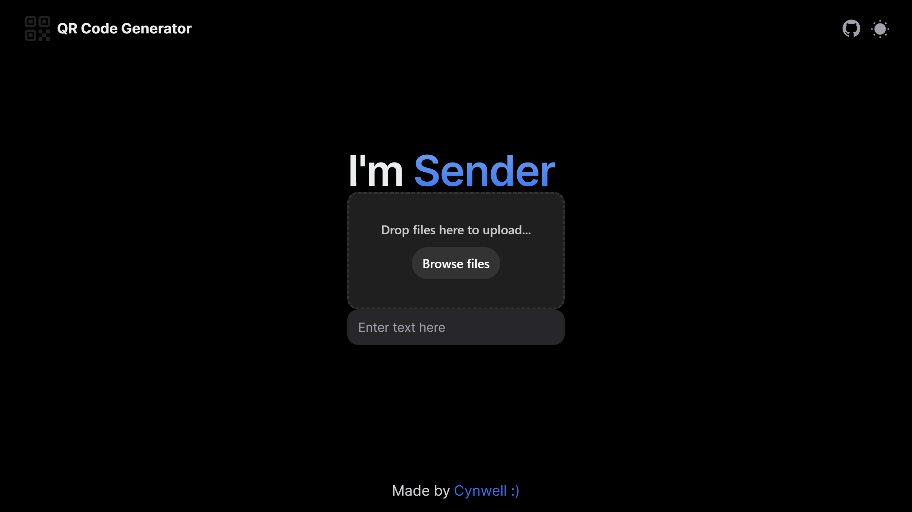
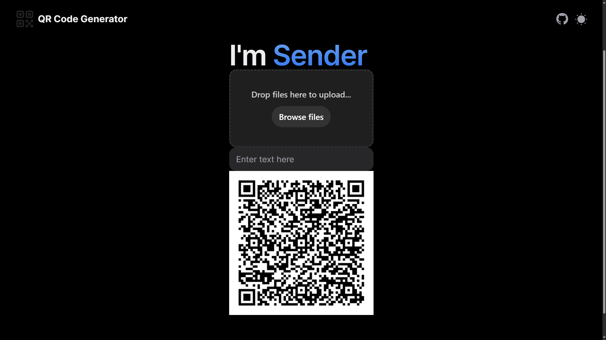
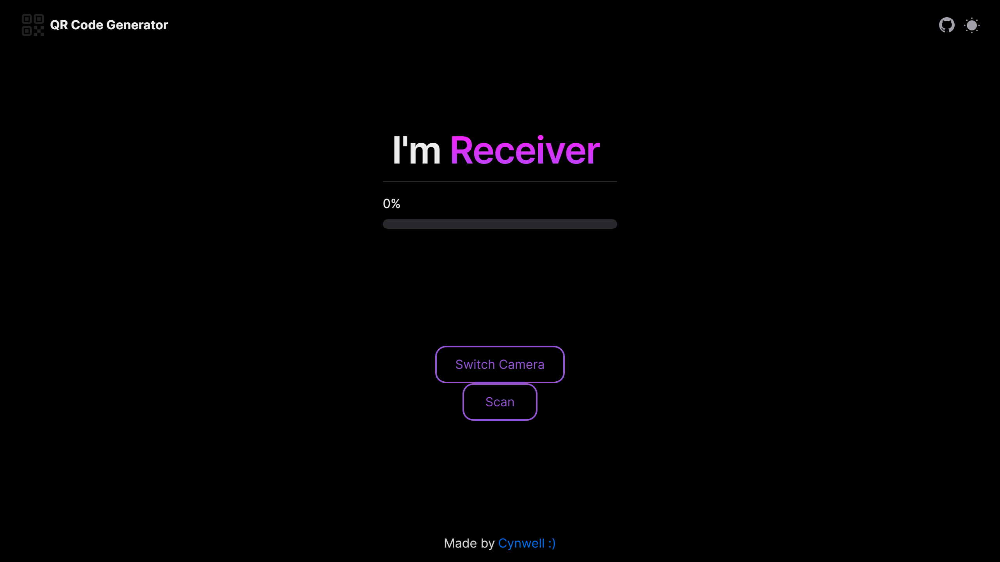
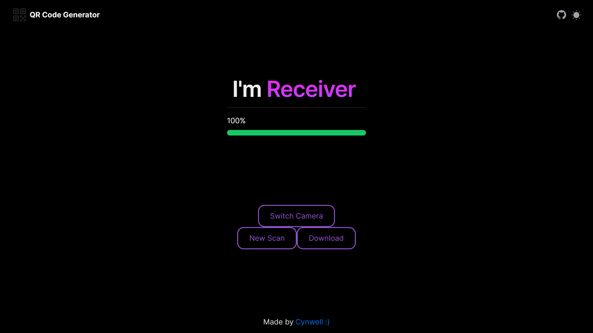

# Animated QR Code Generator

The Animated QR Code Generator is a proof of concept product to experiment transmitting arbitrary data with animated QR codes. It uses Unicode instead of Base64 to encode data for a more space-efficient implementation to store data. Theoretically, it could handle data of unlimited length by segmenting the data into multiple QR codes. The project is built with Next.js, React and TypeScript.

## Prerequisites

Before you begin, ensure you have the following installed:
- Node.js (version 20.10.0 or later)
- pnpm (version 9.2.0 or later) / npm (version 10.2.5 or later)

## Installation

To set up the project for development on your local machine, follow these steps:

1. Clone the repository to your local machine:
   ```sh
   git clone https://github.com/Cynwell/qr-code-generator.git
   ```
2. Navigate to the project directory:
   ```sh
   cd qr-code-generator
   ```
3. Install the dependencies:
   ```sh
   npm install
   ```

## How to Run

To start the application, run the following command in the terminal:

```sh
npm start
```

The application will be available at `http://localhost:3000`.

## Features

- **Unlimited Data Length Support**: Can encode an unlimited length of any text characters and even binary data.
- **Intelligent Data Segmentation**: For data exceeding the QR code's maximum storage limit, it automatically segments the data into several QR codes for display, presented in an a series of animated QR codes.
- **Dynamic QR Code Generation**: Generates QR codes dynamically based on the input data.
- **Support for Files**: Can encode arbitrary files into QR codes, including metadata such as file name, size, and type. Due to browser security restrictions, altering the file creation or modification date is not permitted.
- **Decoding Capability**: Includes a decoding client that can interpret the segmented QR codes and reconstruct the original data in arbitrary order.
- **Indexing System for QR Codes**: Implemented an indexing system for QR codes to represent data order in the format `1/8|(Data)`, enhancing the handling of segmented data across multiple QR codes.
- **Optimized Data Encoding**: Utilizes Unicode encoding to optimize storage space for non-ASCII data, offering a more efficient alternative to traditional Base64 encoding methods.
- **NextUI Integration**: Leveraged NextUI for building a modern and responsive frontend, ensuring a seamless user experience.
- **Drag-and-Drop Components**: Incorporated Uber's baseui library to provide user-friendly drag-and-drop components, facilitating easy file uploads.
- **Progress Visualization**: Added a progress bar to visually represent the data transfer progress to enhance user interaction and feedback.

## TODO

- [ ] Explore optimization techniques for encoding and decoding processes to further improve performance and efficiency. (The trade-off between encoding and decoding speed and data size included in the QR code)

## Contributing

Contributions are welcome! Please feel free to submit a pull request or open an issue for any bugs or feature requests.



<!--  -->

